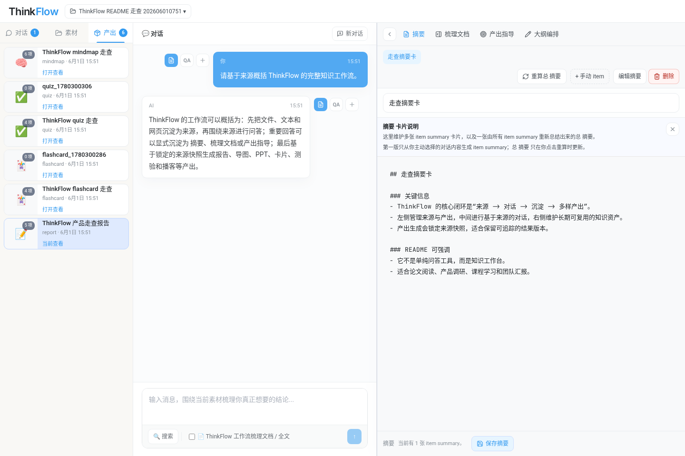
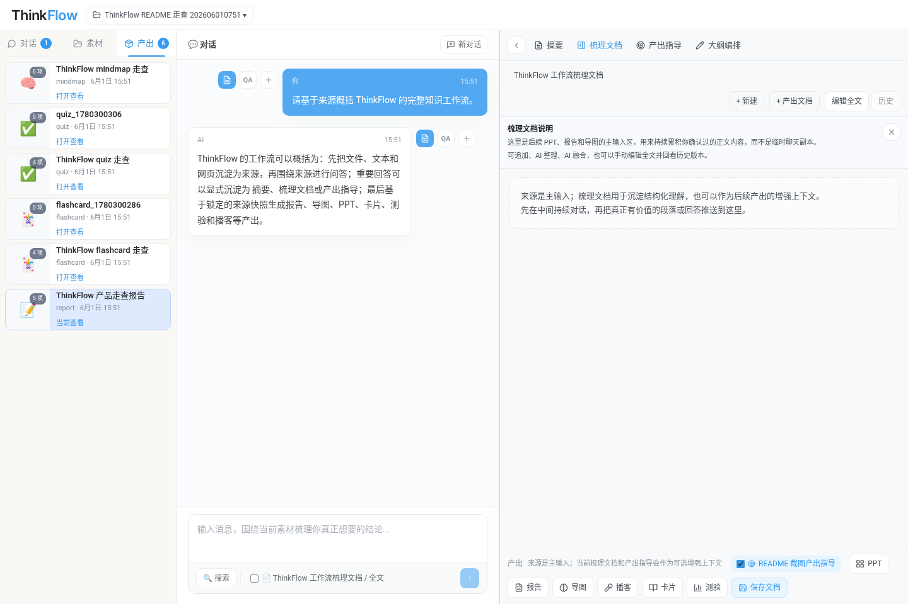
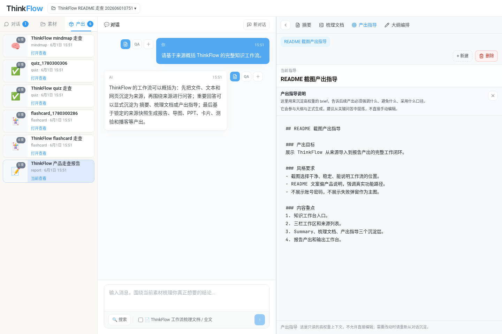
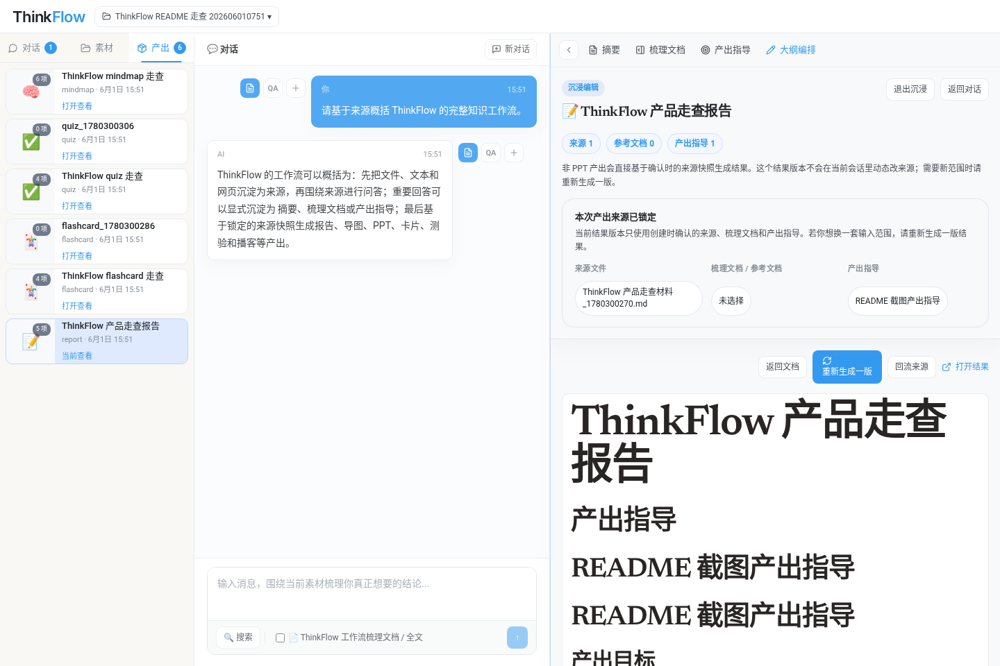
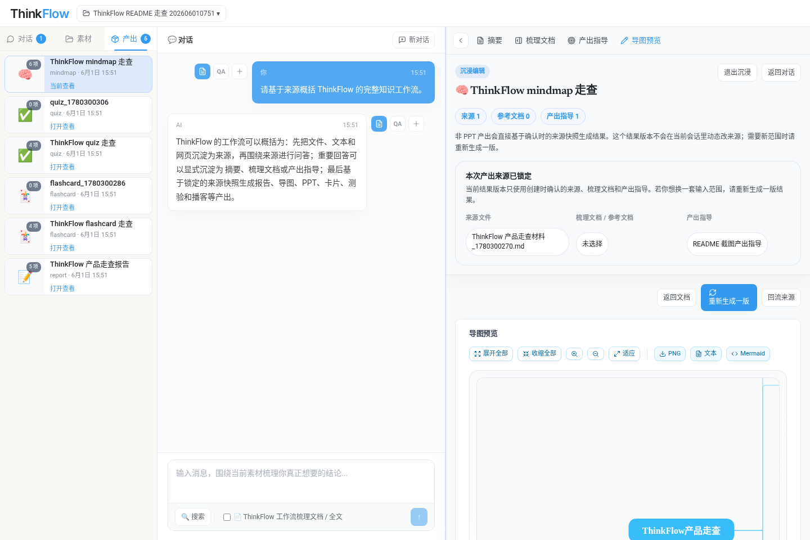
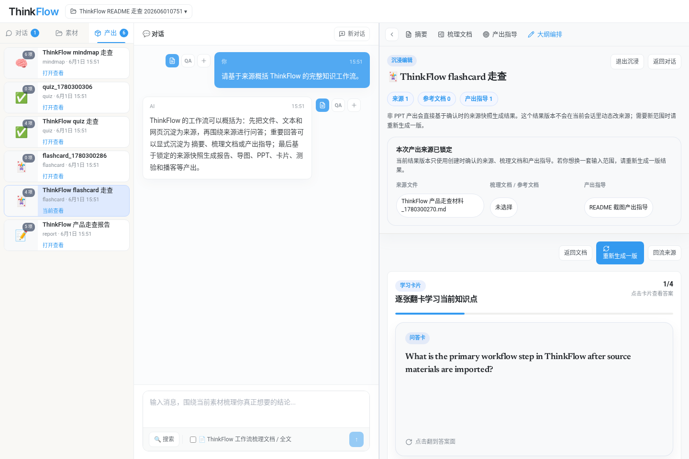
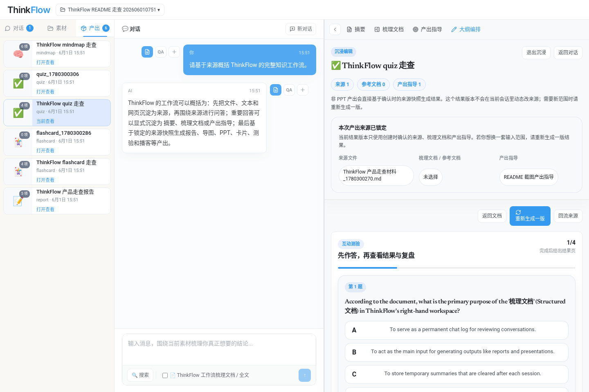
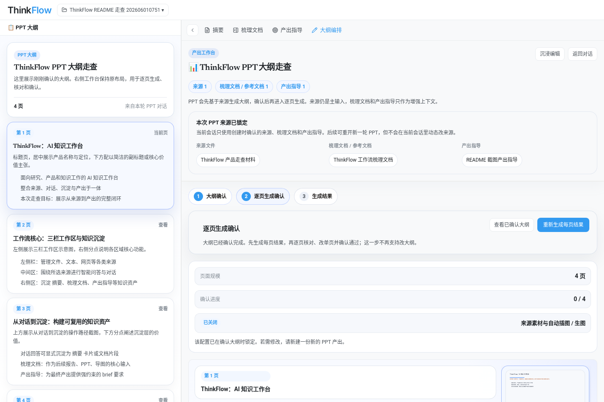
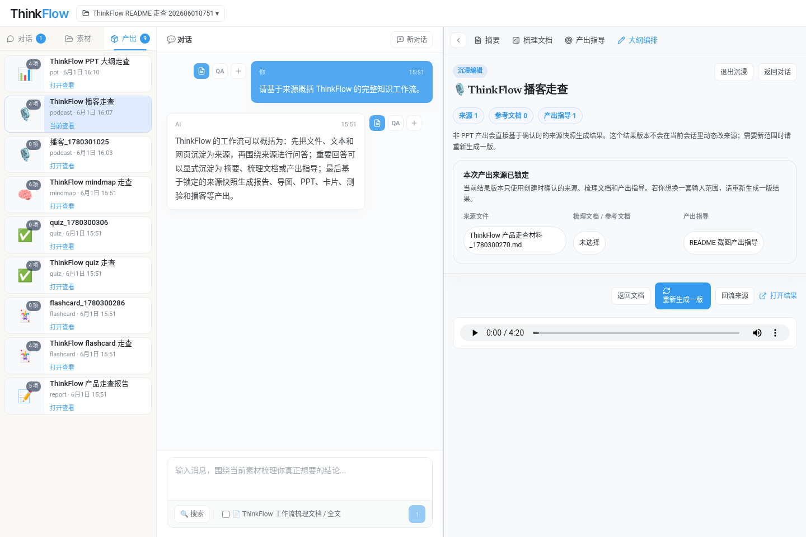

<p align="center">
  
</p>

# Open-NotebookLM / ThinkFlow

Open-NotebookLM 是一个面向论文阅读、产品调研、课程学习和团队汇报的 AI 知识工作台。前端产品形态叫 ThinkFlow，它把资料导入、基于来源的问答、知识沉淀和多形态产出放进同一个笔记本里，让一次资料处理可以持续演化为摘要、梳理文档、报告、导图、PPT、播客、卡片和测验。

项目由 FastAPI 后端、React/Vite 前端和本地文件工作区组成。后端负责来源管理、文档处理、知识库记录、LLM 调用、TTS、PPT/报告等产出编排；前端提供三栏式知识工作台、对话区、文档工作台和产出预览。

> 本 README 的截图来自 2026-06-01 的本地 Playwright 走查，截图材料是演示来源，不包含账号密码。


## 项目能做什么

Open-NotebookLM 解决的是“资料进来以后如何持续加工成可复用成果”的问题。它不是只提供一次性聊天窗口，而是把来源、对话、沉淀和产出组织成一个可回溯的闭环。

- **统一管理来源**：支持上传文件、粘贴文本、导入网页，也可以通过搜索和深度研究补充外部资料。
- **围绕来源问答**：对话区基于已选来源回答问题，适合论文精读、竞品调研、课程复习和材料梳理。
- **把有价值内容沉淀下来**：重要回答可以进入 Summary、梳理文档或产出指导，避免聊天内容一次性消失。
- **生成多种结果**：基于来源快照生成报告、思维导图、PPT、播客、学习卡片和测验。
- **保留产出依据**：产出会锁定当次来源、梳理文档和产出指导，方便后续追溯与重生成。

## 核心工作流

ThinkFlow 的主界面采用三栏布局。左侧管理来源、对话历史和已生成产出；中间是基于来源的主对话；右侧是知识资产和产出工作台。


典型流程如下：

1. **建立笔记本**：每个笔记本对应一次研究、课程、产品调研或汇报任务。
2. **导入来源**：把 PDF、Markdown、网页、访谈纪要或粘贴文本统一登记为来源。
3. **基于来源对话**：围绕选中的来源提问，逐步形成可验证的理解。
4. **沉淀知识资产**：把关键结论保存到 Summary、梳理文档和产出指导。
5. **生成结果**：选择报告、导图、PPT、播客、卡片或测验，基于锁定的来源快照生成成果。

## 功能导览

### 1. 来源与对话

来源是整个系统的第一优先级。用户可以在左侧栏选择参与当前对话和产出的材料，中间对话区会围绕这些来源回答问题。回答旁边提供沉淀入口，方便把单条回答、一轮问答或多条消息推送到右侧知识资产。


### 2. Summary 卡片

Summary 用来保存从对话和资料中提炼出的关键结论。它适合承载“我已经确认过的要点”，也可以进一步重算为总 Summary，作为后续产出的背景材料。



### 3. 梳理文档

梳理文档是后续报告、导图和 PPT 的主输入区。它不是聊天记录副本，而是用户确认过的正文内容，可以持续追加、整理、融合和回看历史版本。



### 4. 产出指导

产出指导是高权重 brief，用来约束后续结果的重点、风格和讲述顺序。它适合保存“最终产出应该强调什么、避免什么、采用什么口径”这类信息。



### 5. 报告生成

报告产出会合并来源、梳理文档和产出指导，生成可预览、可下载的 Markdown/PDF 结果。它适合作为调研报告、论文阅读笔记、课程总结或汇报材料底稿。



### 6. 思维导图

思维导图会把来源内容整理成层级结构，便于快速把握主题、模块和子问题。前端提供展开、收缩、缩放、适应视图、下载 PNG、导出文本和 Mermaid 等操作入口。



### 7. 学习卡片

学习卡片把材料转成逐张翻阅的问答卡，适合课程复习、论文方法记忆、产品知识培训和团队 onboarding。



### 8. 互动测验

测验产出会基于来源生成选择题，并保留正确答案和解释。它适合检查资料理解、课程复习和团队知识验收。



### 9. PPT 工作台

PPT 采用阶段化流程：先生成可讨论的大纲，再确认大纲并进入逐页生成、页级核对和单页重做。PPT 工作台会展示来源锁定、大纲确认、逐页生成确认、确认进度和重新生成入口。



### 10. 播客生成

播客产出会基于锁定来源生成脚本和音频文件。结果页提供音频播放器、重新生成、回流来源和打开结果入口，适合把阅读材料转成可听内容。



## 适用场景

- **论文阅读**：导入论文、实验记录和参考资料，围绕方法、贡献、实验和局限持续提问，再沉淀为摘要、梳理文档和汇报材料。
- **产品调研**：整合网页、竞品资料、访谈纪要和行业报告，生成竞品分析、调研报告、导图和路线图讨论材料。
- **课程学习**：把教材或讲义转成问答、卡片和测验，形成可复习的学习资产。
- **团队汇报**：把原始资料加工为报告、导图和 PPT，并保留来源快照，方便回溯结果依据。
- **数据与表格分析**：项目内还包含数据抽取和表格分析相关接口，可用于把结构化数据接入对话式分析流程。

## 项目结构

```text
.
├── fastapi_app/              # FastAPI 后端，包含认证、知识库、来源、文档、产出、TTS、搜索等路由
├── frontend/                 # React + Vite 前端，ThinkFlow 主界面
├── workflow_engine/          # 工作流和算子引擎
├── vendor/presentagent/      # 可编辑 PPT / PresentAgent 相关集成
├── docs/                     # 设计文档和 README 截图资产
├── outputs/                  # 本地用户数据、来源文件、产出文件和工作区状态
├── scripts/                  # 启停脚本、监控脚本、embedding 启动脚本
└── requirements-base.txt     # Python 后端基础依赖
```

## 快速启动

### 环境要求

- Python 3.11
- Node.js 18 或更高版本
- npm
- 可用的 LLM / Embedding / TTS / Image Generation 配置，按需填写在 `fastapi_app/.env`

### 1. 配置环境变量

复制后端环境变量模板：

```bash
cp fastapi_app/.env.example fastapi_app/.env
```

至少需要根据你要使用的功能配置这些变量：

```bash
LLM_API_URL=https://api.example.com/v1
LLM_API_KEY=your_llm_api_key
LLM_MODEL=your_model_name

EMBEDDING_PROVIDER=apiyi
EMBEDDING_API_URL=https://api.example.com/v1
EMBEDDING_API_KEY=your_embedding_api_key
EMBEDDING_MODEL=text-embedding-3-small

TTS_PROVIDER=apiyi
TTS_API_URL=https://api.example.com/v1
TTS_API_KEY=your_tts_api_key
TTS_MODEL=qwen-tts
```

如果需要登录和云端用户体系，继续配置 Supabase：

```bash
SUPABASE_URL=https://your-project-id.supabase.co
SUPABASE_ANON_KEY=your_supabase_anon_key
SUPABASE_SERVICE_ROLE_KEY=your_supabase_service_role_key
```

如果不配置 Supabase，项目仍可用本地工作区方式运行；数据会主要保存在 `outputs/` 下。

### 2. 安装依赖

后端：

```bash
python -m venv .venv
source .venv/bin/activate
pip install -r requirements-base.txt
```

前端：

```bash
cd frontend
npm install
cd ..
```

### 3. 一键启动

仓库提供了后台启动脚本：

```bash
./scripts/start.sh
```

脚本会启动：

- 后端：`http://localhost:8000`
- 前端：`http://localhost:3001`
- 本地 embedding 服务：默认 `8899` 端口，如果该端口已有服务会复用
- 监控脚本：异常时尝试拉起服务

停止服务：

```bash
./scripts/stop.sh
```

### 4. 手动启动前后端

如果你只想启动前后端，或者本地没有 embedding 模型环境，可以手动运行：

```bash
# 终端 1：后端
python -m uvicorn fastapi_app.main:app --host 0.0.0.0 --port 8000
```

```bash
# 终端 2：前端
cd frontend
npm run dev -- --host 0.0.0.0 --port 3001
```

前端的 Vite 配置会把 `/api` 和 `/outputs` 代理到 `http://localhost:8000`。

### 5. 检查服务

```bash
curl http://localhost:8000/health
```

返回结果应为：

```json
{"status":"ok"}
```

然后打开：

```text
http://localhost:3001
```

## 常用命令

```bash
# 前端构建
cd frontend && npm run build

# 前端测试
cd frontend && npm test

# 查看后端健康状态
curl http://localhost:8000/health

# 停止脚本启动的服务
./scripts/stop.sh
```

## 数据和产物位置

- `outputs/`：笔记本、来源、向量索引、工作区状态和生成结果。
- `logs/`：通过 `scripts/start.sh` 启动时产生的后端、前端和 embedding 日志。
- `docs/assets/thinkflow/`：README 使用的截图资产。

## 更多文档

- [ThinkFlow 走查 README](docs/thinkflow-readme.md)
- [开发架构说明](docs/development-architecture-guide.md)
- [文件处理流程](docs/thinkflow-upload-file-processing-flow.md)
- [OnlyOffice 可编辑 PPT](docs/onlyoffice-editable-ppt.md)
