<div align="center">

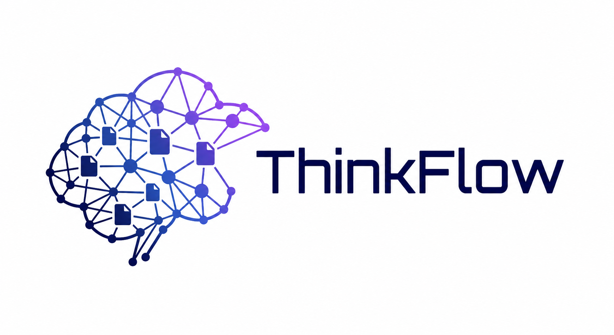

# Open-NotebookLM / ThinkFlow

[](https://www.python.org/)
[](https://fastapi.tiangolo.com/)
[](https://react.dev/)
[](https://vitejs.dev/)
[](LICENSE)
[](https://github.com/OpenDCAI/Open-NotebookLM)

中文 | [English](README_EN.md)

✨ **面向论文阅读、产品调研、课程学习和团队汇报的 AI 知识工作台：从资料导入、来源问答、多模态检索，到文档沉淀、报告、导图、PPT、播客、卡片和测验生成** ✨

| 📚 **基于来源问答** &nbsp;|&nbsp; 🧠 **多模态检索** &nbsp;|&nbsp; 📝 **知识工作台** &nbsp;|&nbsp; 🎬 **多形态产出** |

<br>

<a href="#-快速启动" target="_self">
  
</a>
<a href="#-功能展示" target="_self">
  
</a>
<a href="docs/thinkflow-readme.md" target="_blank">
  
</a>
<a href="docs/development-architecture-guide.md" target="_blank">
  
</a>

<br>
<br>

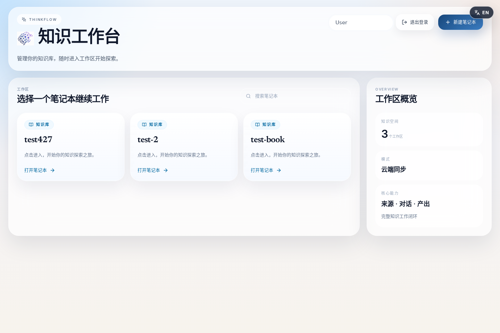

</div>

## 📑 目录

- [✨ 核心功能](#-核心功能)
- [🔁 工作流](#-工作流)
- [📸 功能展示](#-功能展示)
- [🚀 快速启动](#-快速启动)
- [⚙️ 配置说明](#️-配置说明)
- [📂 项目结构](#-项目结构)
- [🧪 开发命令](#-开发命令)
- [📦 数据和产物](#-数据和产物)
- [🗺️ 路线图](#️-路线图)
- [📚 更多文档](#-更多文档)

## ✨ 核心功能

> ThinkFlow 把一个笔记本变成可追踪的知识生产闭环：来源进入笔记本，对话形成理解，确认过的内容被沉淀，最终产出从锁定上下文中生成。

- **📚 统一来源接入**：支持上传文件、粘贴文本、导入网页、搜索和深度研究，把材料统一放进一个笔记本。
- **💬 基于来源问答**：围绕已选来源提问，保留引用、来源映射和多轮上下文。
- **🧠 VLM 多模态检索**：在文本模式和 VLM 模式之间切换，支持图片附件、粘贴图片、PDF 页面图和图表证据检索。
- **🖼️ PDF 图片索引与图库**：可重建 PDF 图片索引、查看抽取图片，并让视觉证据参与检索和后续产出。
- **📝 知识工作台**：把有价值的回答保存为 Summary 卡片、可编辑文档和产出指导，避免知识散落在聊天里。
- **📌 对话状态保留**：按对话保存已选来源、绑定文档、活跃文档和产出上下文。
- **📄 报告生成**：基于来源、梳理文档和产出指导生成报告草稿。
- **🗺️ 思维导图生成**：把材料整理成层级结构，支持预览和导出。
- **🎞️ PPT 工作流**：先生成大纲，再逐页生成和确认演示内容。
- **🎧 播客生成**：把来源内容转成脚本和可播放音频。
- **🧩 学习产出**：生成学习卡片和测验，适合课程复习、团队培训和知识验收。
- **🎬 视频生成**：基于资料和脚本生成分镜、口播稿和视频结果。

---

## 🔁 工作流

<div align="center">

| 1. 导入 | 2. 提问 | 3. 沉淀 | 4. 约束 | 5. 生成 |
| --- | --- | --- | --- | --- |
| PDF / Word / 图片 / 音频 / 视频 / 文本 / 网页 | 文本 RAG 或 VLM 检索 | Summary、文档和可复用笔记 | 产出指导和来源快照 | 报告、导图、PPT、视频、播客、卡片、测验 |

</div>

ThinkFlow 不是一次性聊天窗口，而是为持续知识工作设计的工作台：

1. **创建笔记本**：对应一篇论文、一次产品调研、一门课程或一场团队汇报。
2. **导入来源**：选择哪些来源参与当前对话或产出。
3. **基于来源提问**：文本模式处理普通资料，VLM 模式处理图片、截图、PDF 图表和视觉证据。
4. **沉淀确认过的内容**：把关键结论保存到 Summary、文档和产出指导。
5. **生成最终成果**：从锁定的来源、文档和指导中生成可追溯结果。

---

## 📸 功能展示

### 📚 来源工作区与基于来源问答

<div align="center">

<table>
  <tr>
    <td width="50%" align="center" valign="top">
      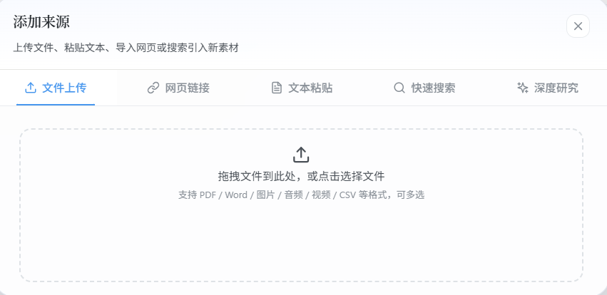
      <br><sub>✨ 将文件、文本、网页、搜索和深度研究材料统一放进笔记本</sub>
    </td>
    <td width="50%" align="center" valign="top">
      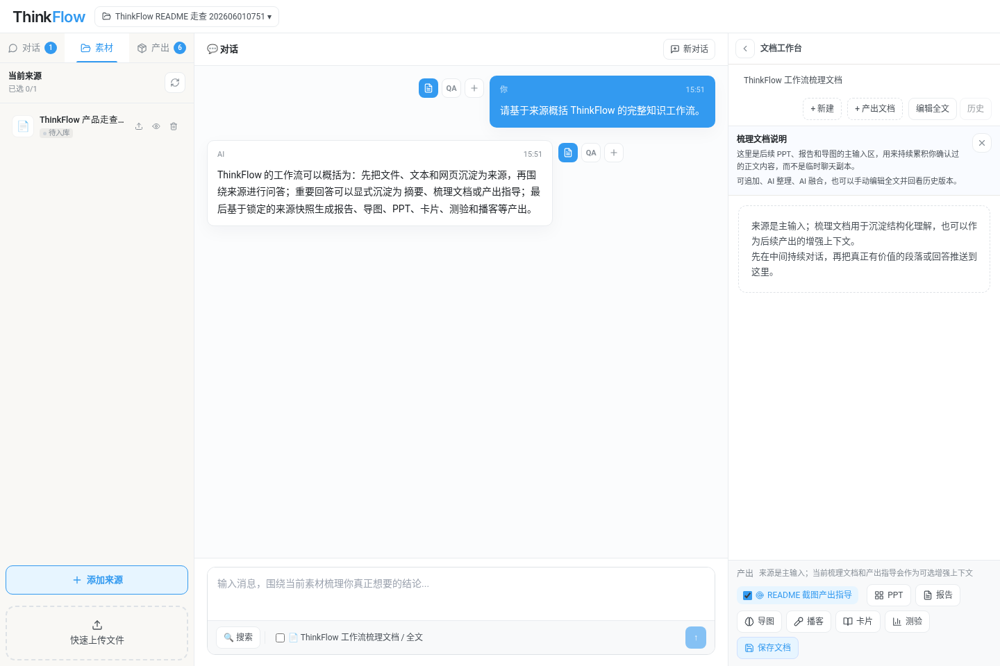
      <br><sub>✨ 三栏式工作区统一管理来源、对话、文档和产出</sub>
    </td>
  </tr>
</table>

</div>

### 🧠 多模态检索

<div align="center">

<table>
  <tr>
    <td width="50%" align="center" valign="top">
      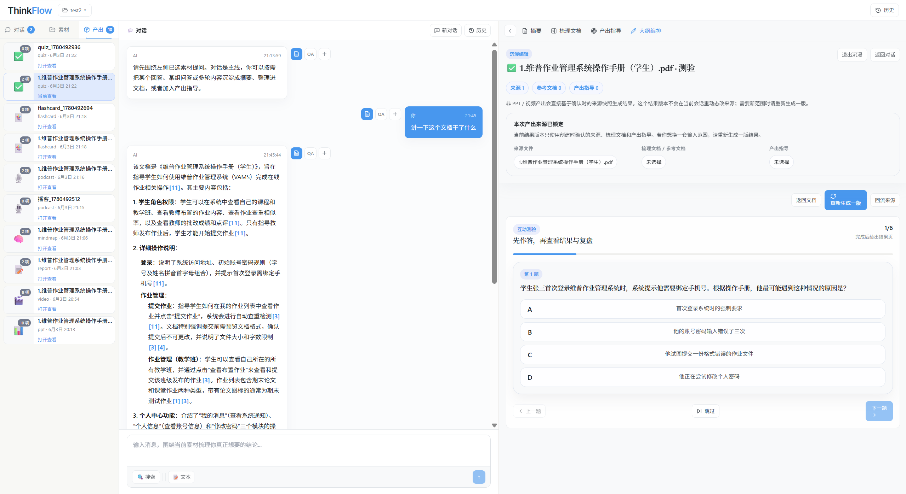
      <br><sub>✨ 文本模式检索来源片段，并围绕上下文回答问题</sub>
    </td>
    <td width="50%" align="center" valign="top">
      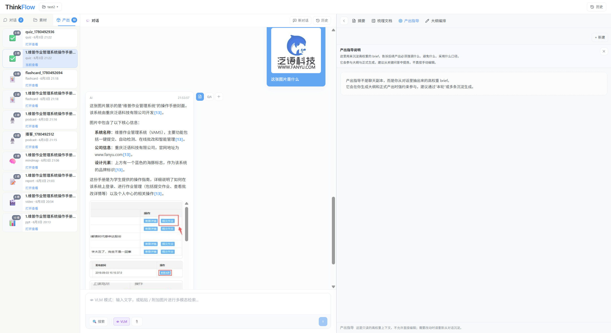
      <br><sub>✨ VLM 模式支持图片提问，并检索 PDF 和图片来源里的视觉证据</sub>
    </td>
  </tr>
</table>

</div>

### 📝 知识工作台

<div align="center">

<table>
  <tr>
    <td width="33%" align="center" valign="top">
      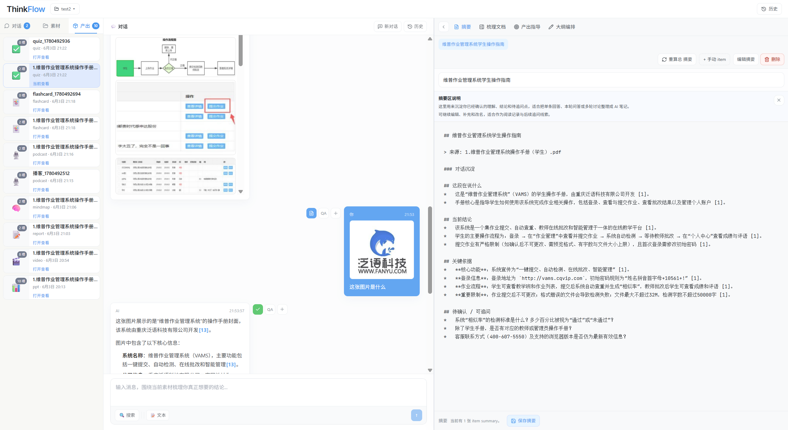
      <br><sub>✨ 把关键结论保存为 Summary 卡片</sub>
    </td>
    <td width="34%" align="center" valign="top">
      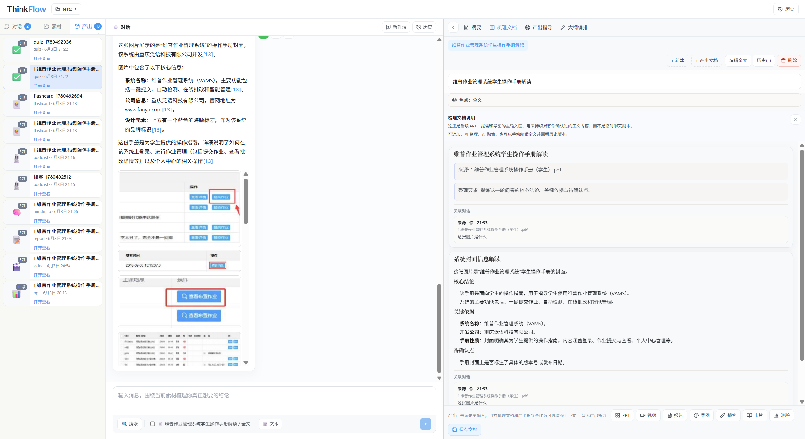
      <br><sub>✨ 维护可编辑梳理文档，作为报告和 PPT 的主输入</sub>
    </td>
    <td width="33%" align="center" valign="top">
      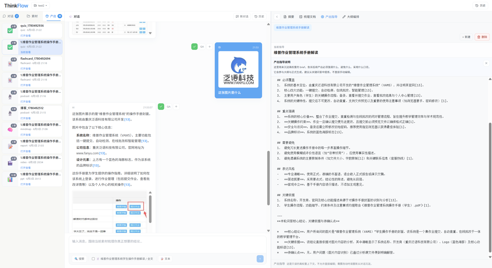
      <br><sub>✨ 保存受众、风格和重点约束，指导后续生成</sub>
    </td>
  </tr>
</table>

<br>

<table>
  <tr>
    <td width="50%" align="center" valign="top">
      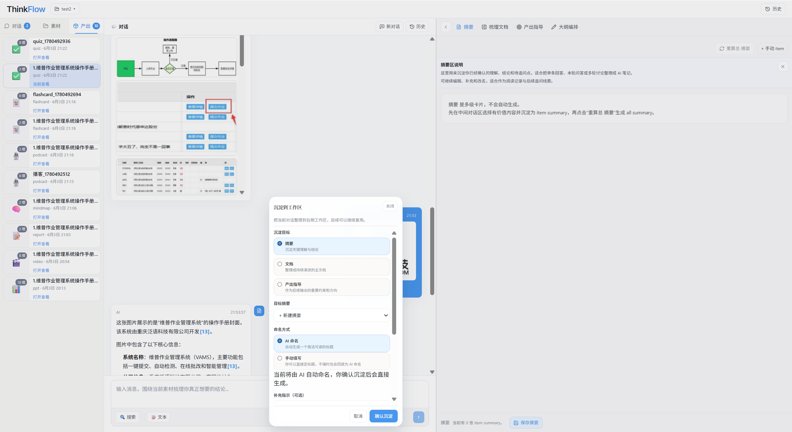
      <br><sub>✨ 将有价值的对话回答推送到可复用知识资产</sub>
    </td>
    <td width="50%" align="center" valign="top">
      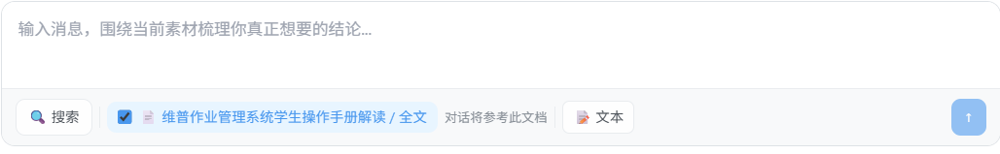
      <br><sub>✨ 在后续产出中显式引用已经沉淀的文档</sub>
    </td>
  </tr>
</table>

</div>

### 📄 报告与导图

<div align="center">

<table>
  <tr>
    <td width="50%" align="center" valign="top">
      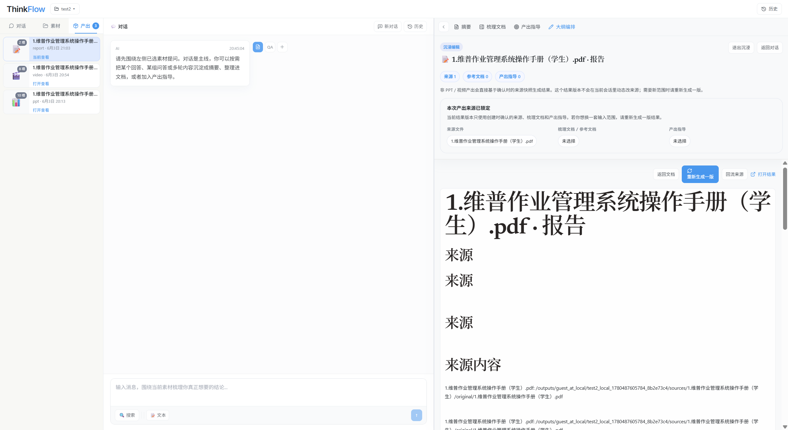
      <br><sub>✨ 从来源、文档和产出指导生成报告草稿</sub>
    </td>
    <td width="50%" align="center" valign="top">
      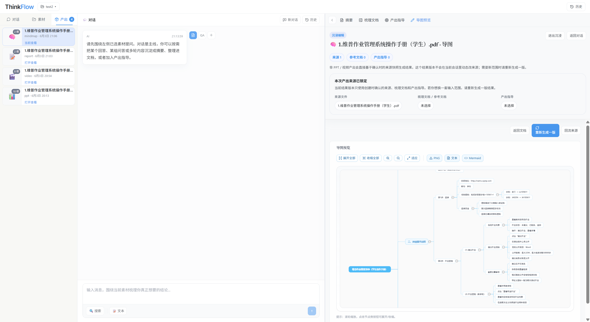
      <br><sub>✨ 把材料整理成层级导图，便于快速复盘</sub>
    </td>
  </tr>
</table>

</div>

### 🧩 学习产出

<div align="center">

<table>
  <tr>
    <td width="33%" align="center" valign="top">
      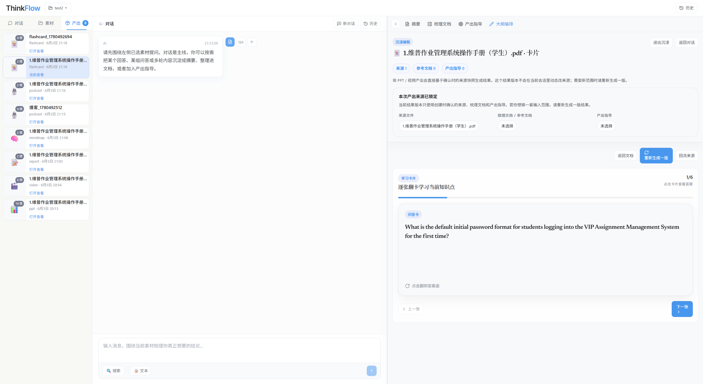
      <br><sub>✨ 将来源内容转成学习卡片</sub>
    </td>
    <td width="34%" align="center" valign="top">
      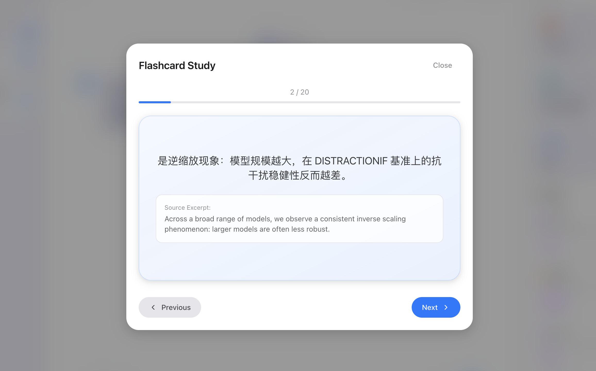
      <br><sub>✨ 在工作台里翻阅和复习卡片</sub>
    </td>
    <td width="33%" align="center" valign="top">
      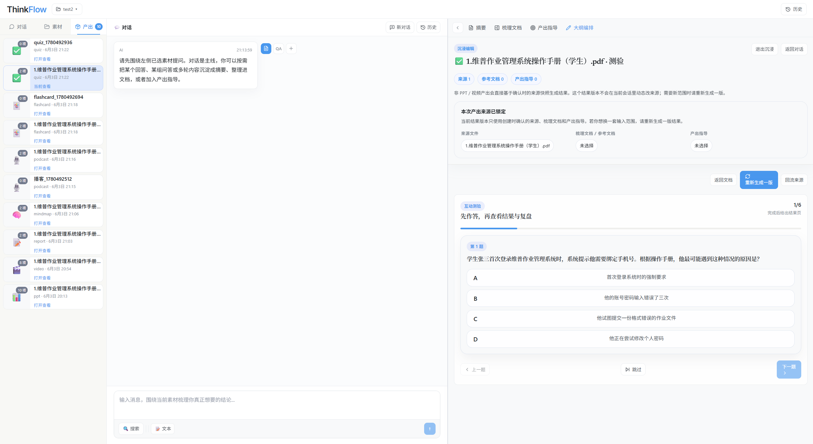
      <br><sub>✨ 生成带答案和解释的测验题</sub>
    </td>
  </tr>
</table>

</div>

### 🎞️ PPT、视频和播客

<div align="center">

<table>
  <tr>
    <td width="33%" align="center" valign="top">
      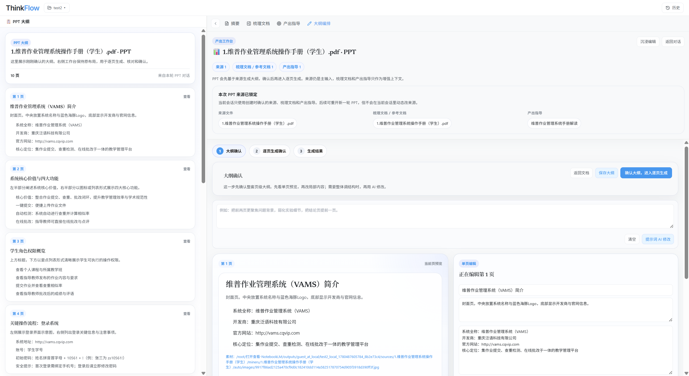
      <br><sub>✨ 先生成并调整 PPT 大纲，再进入逐页生成</sub>
    </td>
    <td width="34%" align="center" valign="top">
      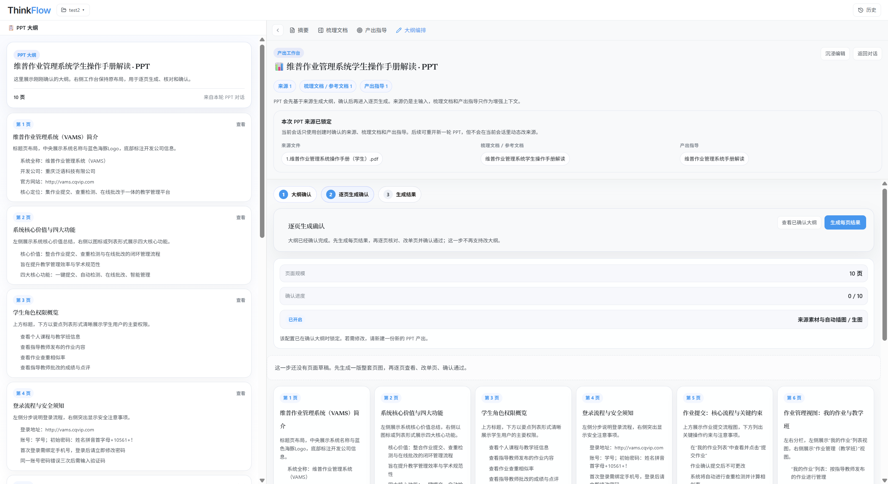
      <br><sub>✨ 检查逐页生成进度和页面内容</sub>
    </td>
    <td width="33%" align="center" valign="top">
      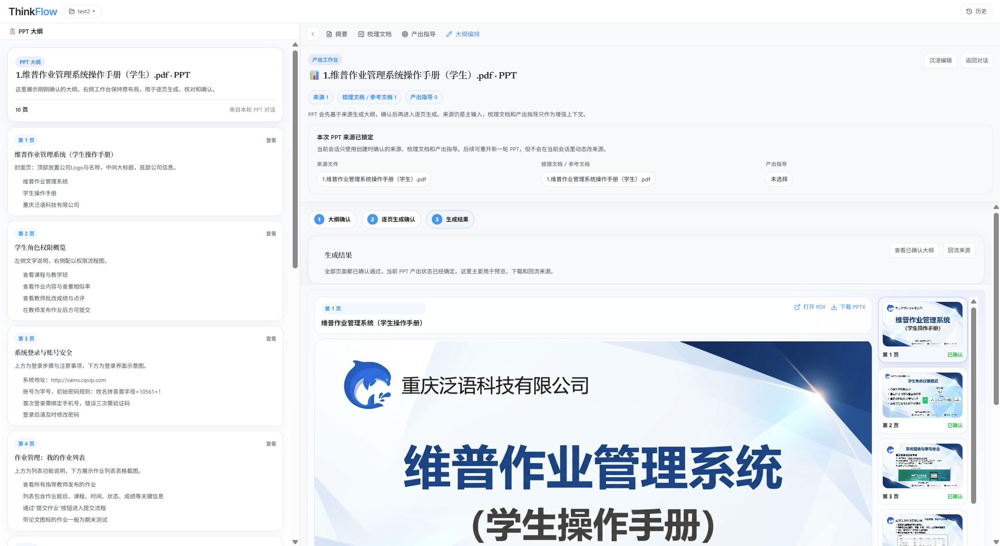
      <br><sub>✨ 在产出工作台中打开生成结果</sub>
    </td>
  </tr>
</table>

<br>

<table>
  <tr>
    <td width="50%" align="center" valign="top">
      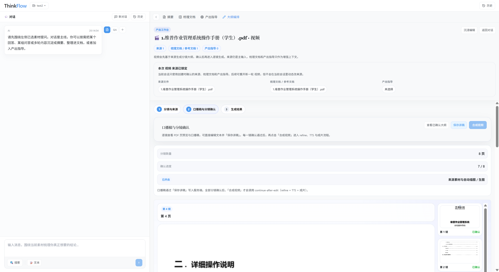
      <br><sub>✨ 生成视频前确认口播稿和分镜</sub>
    </td>
    <td width="50%" align="center" valign="top">
      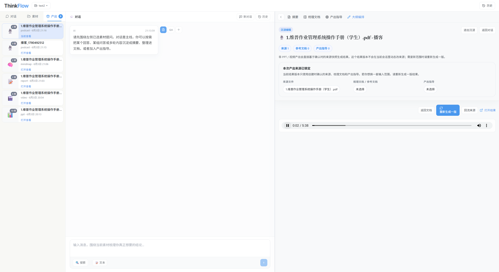
      <br><sub>✨ 从锁定来源生成播客脚本和可播放音频</sub>
    </td>
  </tr>
</table>

<br>

<a href="docs/assets/showcase/video-demo.mp4">查看视频生成演示</a>

</div>

---

## 🚀 快速启动

### 环境要求

- Python 3.11 或更高版本
- Node.js 18 或更高版本
- npm
- 可用的 LLM 和 embedding API 配置
- 可选：`ffmpeg`，用于音视频处理和媒体产出

Ubuntu 常用运行依赖示例：

```bash
sudo apt-get update
sudo apt-get install -y ffmpeg libxcb-shm0 libxcb-shape0 libxcb-xfixes0
```

### 1. 克隆项目

```bash
git clone https://github.com/OpenDCAI/Open-NotebookLM.git
cd Open-NotebookLM
```

### 2. 创建环境并安装后端依赖

```bash
python -m venv .venv
source .venv/bin/activate
pip install -r requirements.txt
```

如果需要运行测试：

```bash
pip install -r requirements-dev.txt
```

### 3. 安装前端依赖

```bash
cd frontend
npm install
cd ..
```

### 4. 配置环境变量

```bash
cp fastapi_app/.env.example fastapi_app/.env
```

编辑 `fastapi_app/.env`，至少填写 LLM 和 embedding 配置。示例见 [配置说明](#️-配置说明)。

### 5. 一键启动

```bash
./scripts/start.sh
```

脚本会启动：

- 后端：`http://localhost:8000`
- 前端：`http://localhost:3001`
- 本地 embedding 服务：默认 `8899` 端口，如果端口已有服务会复用
- 监控脚本：用于基础进程恢复

停止服务：

```bash
./scripts/stop.sh
```

### 6. 手动启动

如果不希望脚本启动内置本地 embedding 服务，可以手动启动前后端：

```bash
# 终端 1：后端
python -m uvicorn fastapi_app.main:app --host 0.0.0.0 --port 8000
```

```bash
# 终端 2：前端
cd frontend
npm run dev -- --host 0.0.0.0 --port 3001
```

打开：

```text
http://localhost:3001
```

健康检查：

```bash
curl http://localhost:8000/health
```

期望返回：

```json
{"status":"ok"}
```

---

## ⚙️ 配置说明

后端配置位于 `fastapi_app/.env`。示例文件只包含占位符，请替换为你自己的服务配置。

### LLM

```bash
LLM_API_URL=https://api.example.com/v1
LLM_API_KEY=your_llm_api_key
LLM_MODEL=your_model_name
```

### Embedding

OpenAI 兼容或 ApiYi 兼容 embedding：

```bash
EMBEDDING_PROVIDER=apiyi
EMBEDDING_API_URL=https://api.example.com/v1
EMBEDDING_API_KEY=your_embedding_api_key
EMBEDDING_MODEL=text-embedding-3-small
EMBEDDING_DIMENSION=1536
```

本地 embedding 服务：

```bash
EMBEDDING_PROVIDER=local
EMBEDDING_API_URL=http://localhost:8899/v1
EMBEDDING_API_KEY=
EMBEDDING_MODEL=/path/to/your/embedding-model
EMBEDDING_DIMENSION=1024
```

> [!NOTE]
> `scripts/start.sh` 会在 `8899` 端口空闲时尝试启动 `scripts/start_embedding_4b.sh`。如果你的机器没有默认本地模型路径，请设置 `EMBEDDING_MODEL` 和 `EMBEDDING_PYTHON_BIN`，或改用外部 embedding provider。

### VLM 与视觉 embedding

这些配置用于启用图片附件、PDF 图片检索和多模态回答：

```bash
KB_VLM_MODEL=your_multimodal_chat_model
VISUAL_EMBEDDING_API_URL=https://api.example.com/v1
VISUAL_EMBEDDING_API_KEY=your_visual_embedding_api_key
VISUAL_EMBEDDING_MODEL=your_visual_embedding_model
```

如果 `VISUAL_EMBEDDING_API_KEY` 留空，视觉 embedding 客户端可以回退使用普通 embedding key。即使未配置 VLM 或视觉 embedding，文本 RAG、来源导入、文档沉淀和标准产出仍可运行。

### TTS、搜索、图像生成和视频

```bash
TTS_PROVIDER=apiyi
TTS_API_URL=https://api.example.com/v1
TTS_API_KEY=your_tts_api_key
TTS_MODEL=qwen-tts

SEARCH_PROVIDER=serper
SERPER_API_KEY=your_serper_key_here
SERPAPI_KEY=your_serpapi_key_here
BOCHA_API_KEY=your_bocha_key_here

IMAGE_GEN_API_URL=https://api.example.com/v1
IMAGE_GEN_API_KEY=your_image_gen_api_key
IMAGE_GEN_MODEL=your_image_model

GUI_PLUS_API_KEY=your_dashscope_or_bailian_key
LIVEPORTRAIT_KEY=your_liveportrait_key
```

### Supabase 认证

Supabase 是可选配置。未配置时，应用仍可使用 `outputs/` 下的本地工作区数据运行。

```bash
SUPABASE_URL=https://your-project-id.supabase.co
SUPABASE_ANON_KEY=your_supabase_anon_key
SUPABASE_SERVICE_ROLE_KEY=your_supabase_service_role_key
```

---

## 📂 项目结构

```text
.
├── fastapi_app/              # FastAPI 后端：认证、笔记本、来源、文档、产出、搜索、TTS
├── frontend/                 # React + Vite 前端，ThinkFlow 主工作区
├── workflow_engine/          # 工作流编排、多模态工具、提示词模板和产出流水线
├── docs/                     # 产品文档、架构说明、走查文档和 README 资产
│   └── assets/               # README/docs 使用的截图、logo 和视频素材
├── scripts/                  # 启停脚本、监控脚本和本地 embedding 服务启动脚本
├── static/                   # 静态 README/产品资产
├── requirements.txt          # Python 依赖入口
├── requirements-base.txt     # 后端运行时依赖
└── requirements-dev.txt      # 测试/开发依赖
```

---

## 🧪 开发命令

```bash
# 后端测试
pytest -q

# 后端语法检查
python -m compileall fastapi_app workflow_engine scripts

# 前端构建
cd frontend && npm run build

# 前端测试
cd frontend && npm test

# 服务健康检查
curl http://localhost:8000/health

# 停止脚本启动的服务
./scripts/stop.sh
```

---

## 📦 数据和产物

- `outputs/`：笔记本、上传来源、生成结果、向量索引和本地工作区状态。
- `logs/`：通过 `scripts/start.sh` 启动时生成的后端、前端和 embedding 日志。
- `docs/assets/thinkflow/`：README logo 和走查截图。
- `docs/assets/showcase/`：功能展示截图和视频演示素材。

> [!IMPORTANT]
> 不要提交真实 `.env`、provider API key、模型凭据、生成的用户数据或私有笔记本产物。

---

## 🗺️ 路线图

| 状态 | 模块 | 方向 |
| --- | --- | --- |
| ✅ | 基于来源的知识工作台 | 笔记本、来源、对话、引用、文档和产出 |
| ✅ | 多模态检索 | VLM 模式、图片附件、视觉 embedding、PDF 图片图库 |
| ✅ | 知识资产 | Summary 卡片、可编辑文档、产出指导、文档引用 |
| ✅ | 多形态产出 | 报告、导图、PPT、播客、卡片、测验、视频 |
| 🚧 | 可编辑产出流程 | 为 PPT、视频和报告提供更结构化的审阅与编辑闭环 |
| 🚧 | 部署方案 | 补充 Docker/生产部署和 provider 配置指南 |
| 🚧 | 评测与追踪 | 增强生成 trace、来源覆盖检查和产出质量诊断 |

---

## 📚 更多文档

- [docs/](docs/)

您可以使用 Claude Code / Codex 阅读 `docs/`，帮助理解整个项目。

---

## 📄 许可证

本项目使用 [Apache License 2.0](LICENSE)。
