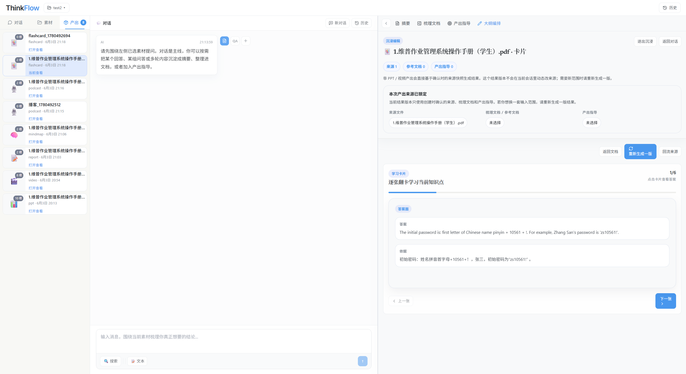
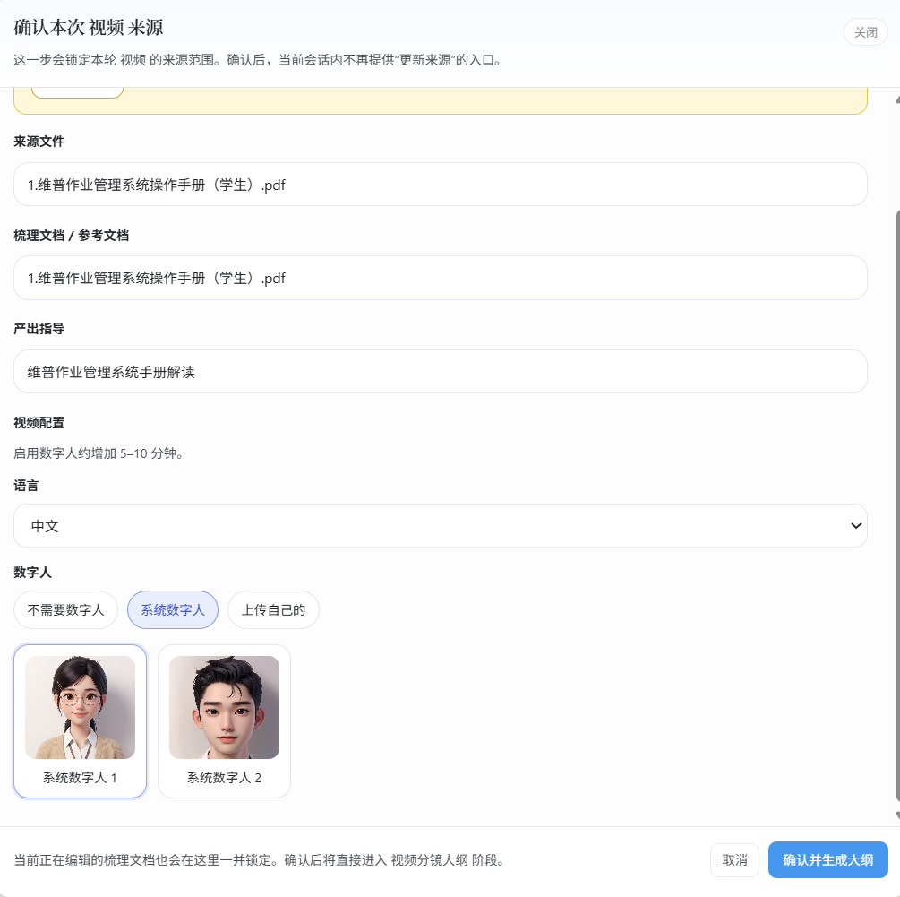
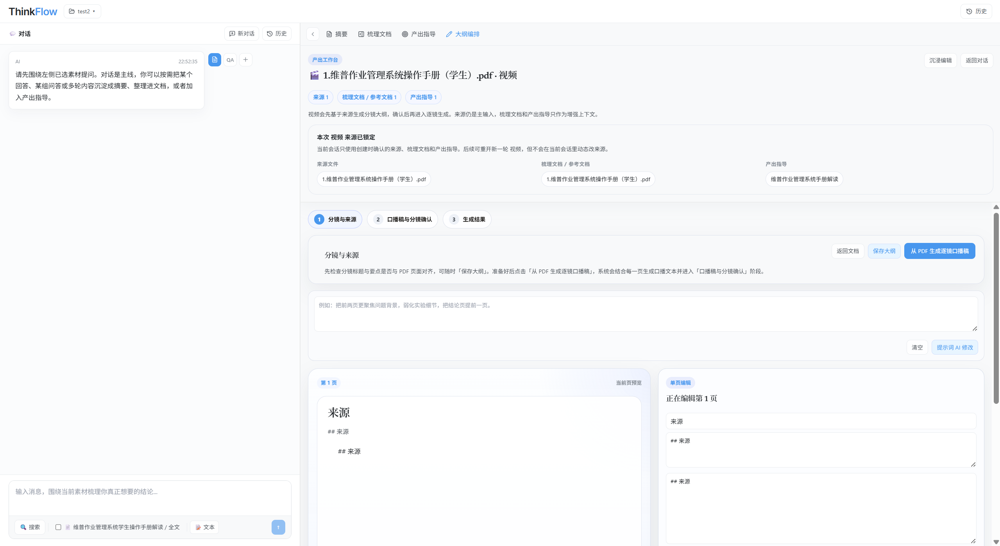
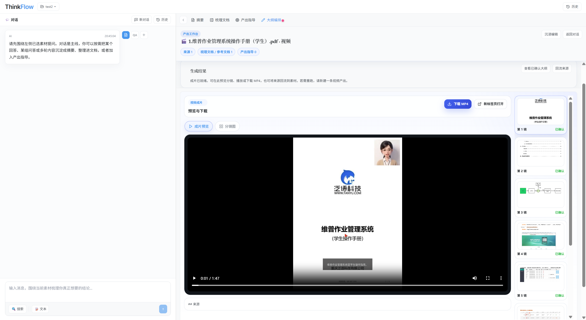
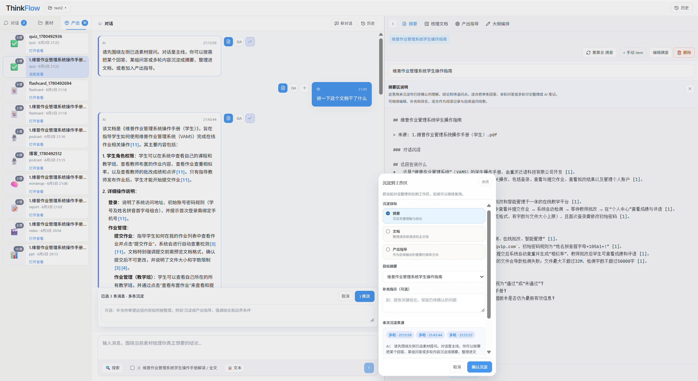

<p align="center">
  
</p>

# Open-NotebookLM / ThinkFlow

Open-NotebookLM 是一个面向论文阅读、产品调研、课程学习和团队汇报的 AI 知识工作台。前端产品形态叫 ThinkFlow，它把资料导入、基于来源的问答、文本/图片多模态检索、知识沉淀和多形态产出放进同一个笔记本里，让一次资料处理可以持续演化为摘要、梳理文档、报告、导图、PPT、播客、卡片和测验。

项目由 FastAPI 后端、React/Vite 前端和本地文件工作区组成。后端负责来源管理、文档处理、文本与视觉向量索引、知识库记录、LLM/VLM 调用、TTS、PPT/报告等产出编排；前端提供三栏式知识工作台、对话区、图片附件、PDF 图片图库、文档工作台和产出预览。


## 项目能做什么

Open-NotebookLM 解决的是“资料进来以后如何持续加工成可复用成果”的问题。它不是只提供一次性聊天窗口，而是把来源、对话、沉淀和产出组织成一个可回溯的闭环。

- **统一管理来源**：支持上传文件、粘贴文本、导入网页，也可以通过搜索和深度研究补充外部资料。
- **围绕来源问答**：对话区基于已选来源回答问题，适合论文精读、竞品调研、课程复习和材料梳理。
- **VLM 多模态检索**：对话区可在文本检索和 VLM 检索之间切换，支持粘贴/附加图片，用图片问题或视觉线索检索 PDF 页面图、插图和图片来源。
- **PDF 图片索引与图库**：PDF 入库后可以重建图片索引、提取图片并在来源侧查看，VLM 模式会优先利用视觉索引和多模态 embedding。
- **音视频来源处理**：音频、视频和图片可以作为来源进入工作区，后端会尽量转写、OCR 或调用 VLM 生成可检索内容。
- **把有价值内容沉淀下来**：重要回答可以进入 Summary、梳理文档或产出指导，避免聊天内容一次性消失。
- **保留对话上下文**：支持新建对话、查看历史对话，并保存每轮对话绑定的来源、活跃文档和产出工作区状态。
- **生成多种结果**：基于来源快照生成报告、思维导图、PPT、播客、学习卡片和测验。
- **保留产出依据**：产出会锁定当次来源、梳理文档和产出指导，方便后续追溯与重生成。

## 核心工作流

ThinkFlow 的主界面采用三栏布局。左侧管理来源、对话历史和已生成产出；中间是基于来源的主对话；右侧是知识资产和产出工作台。


典型流程如下：

1. **建立笔记本**：每个笔记本对应一次研究、课程、产品调研或汇报任务。
2. **导入来源**：把 PDF、Markdown、网页、访谈纪要或粘贴文本统一登记为来源。
3. **基于来源对话**：围绕选中的来源提问，逐步形成可验证的理解；需要读图、看 PDF 页面图或上传截图时，可切换到 VLM 模式。
4. **沉淀知识资产**：把关键结论保存到 Summary、梳理文档和产出指导。
5. **生成结果**：选择报告、导图、PPT、播客、卡片或测验，基于锁定的来源快照生成成果。

## 功能导览

### 1. 来源与对话

来源是整个系统的第一优先级。用户可以在左侧栏选择参与当前对话和产出的材料，中间对话区会围绕这些来源回答问题。回答旁边提供沉淀入口，方便把单条回答、一轮问答或多条消息推送到右侧知识资产。


### 2. VLM 多模态检索与图片附件

最新合并的多模态检索能力把普通文本 RAG 扩展为文本、图片和 PDF 页面图的联合检索。中间对话区可以一键切换“文本 / VLM”模式；在 VLM 模式下，用户可以直接粘贴图片、附加本地图片，或用文字问题检索 PDF 中抽取出的图片、页面截图和图表。后端会使用 `VISUAL_EMBEDDING_*` 配置构建视觉索引；如果没有单独配置视觉 embedding，也会按配置回退到普通 embedding 服务。

这一能力适合处理论文图表、PPT 截图、产品页面截图、实验结果图和带大量插图的 PDF。回答中可以返回检索到的图片线索，帮助用户从“图片证据”回到原始来源。


### 3. PDF 图片索引、图库与多格式来源

PDF 来源除了正文解析外，还支持提取页面图和内嵌图片，并在左侧来源区提供图片索引重建、PDF 图片查看等入口。对于图片来源，系统可以调用 VLM 做 OCR/描述；对于音频和视频来源，后端会尽量转写成可检索文本，让访谈、演示视频、课程录音也能进入同一个知识库。

这类多格式来源会统一沉淀到笔记本目录下，并参与后续对话、文档沉淀和报告/PPT 等产出。

### 4. 对话历史与工作区状态

ThinkFlow 现在支持更完整的多轮对话工作区。用户可以新建对话、查看历史对话，并在每个对话中保存当前选择的来源、绑定文档、活跃文档和相关产出状态。这样同一个笔记本可以容纳多个研究分支，例如“论文方法细读”“实验复现问题”“汇报大纲讨论”，每个分支都能保留自己的上下文。


### 5. Summary 卡片

Summary 用来保存从对话和资料中提炼出的关键结论。它适合承载“我已经确认过的要点”，也可以进一步重算为总 Summary，作为后续产出的背景材料。


### 6. 梳理文档

梳理文档是后续报告、导图和 PPT 的主输入区。它不是聊天记录副本，而是用户确认过的正文内容，可以持续追加、整理、融合和回看历史版本。


### 7. 产出指导

产出指导是高权重 brief，用来约束后续结果的重点、风格和讲述顺序。它适合保存“最终产出应该强调什么、避免什么、采用什么口径”这类信息。


### 8. 报告生成

报告产出会合并来源、梳理文档和产出指导，生成可预览、可下载的 Markdown/PDF 结果。它适合作为调研报告、论文阅读笔记、课程总结或汇报材料底稿。


### 9. 思维导图

思维导图会把来源内容整理成层级结构，便于快速把握主题、模块和子问题。前端提供展开、收缩、缩放、适应视图、下载 PNG、导出文本和 Mermaid 等操作入口。


### 10. 学习卡片

学习卡片把材料转成逐张可翻阅的问答卡，适合课程复习、论文方法记忆、产品知识培训和团队 onboarding。





### 11. 互动测验

测验产出会基于来源生成选择题，并保留正确答案和解释。它适合检查资料理解、课程复习和团队知识验收。


### 12. PPT 工作台

PPT 采用阶段化流程：先生成可讨论的大纲，再确认大纲并进入逐页生成、页级核对和单页重做。PPT 工作台会展示来源锁定、大纲确认、逐页生成确认、确认进度和重新生成入口。


### 13. 视频生成

视频生成会基于文档/PPT 生成分镜、口播稿和最终成片，流程包括来源确认、语言选择、数字人配置、分镜生成、口播稿确认、语音合成和视频合成。用户可以选择不使用数字人、使用系统数字人，或上传自己的数字人素材；最终成片支持数字人口播讲解，结果可以在页面内预览，也可以下载 MP4。








视频展示文件已放入仓库文档资产：

[查看视频生成演示](docs/assets/showcase/video-demo.mp4)

### 14. 播客生成

播客产出会基于锁定来源生成脚本和音频文件。结果页提供音频播放器、重新生成、回流来源和打开结果入口，适合把阅读材料转成可听内容。


## 适用场景

- **论文阅读**：导入论文、实验记录和参考资料，围绕方法、贡献、实验和局限持续提问，再沉淀为摘要、梳理文档和汇报材料。
- **产品调研**：整合网页、竞品资料、访谈纪要和行业报告，生成竞品分析、调研报告、导图和路线图讨论材料。
- **课程学习**：把教材或讲义转成问答、卡片和测验，形成可复习的学习资产。
- **团队汇报**：把原始资料加工为报告、导图和 PPT，并保留来源快照，方便回溯结果依据。
- **数据与表格分析**：项目内还包含数据抽取和表格分析相关接口，可用于把结构化数据接入对话式分析流程。

## 项目结构

```text
.
├── fastapi_app/              # FastAPI 后端，包含认证、知识库、来源、文档、产出、TTS、搜索等路由
├── frontend/                 # React + Vite 前端，ThinkFlow 主界面
├── workflow_engine/          # 工作流和算子引擎
├── vendor/presentagent/      # 可编辑 PPT / PresentAgent 相关集成
├── docs/                     # 设计文档和 README 截图/视频资产
│   └── assets/showcase/      # README 展示截图和演示视频素材
├── outputs/                  # 本地用户数据、来源文件、产出文件和工作区状态
├── scripts/                  # 启停脚本、监控脚本、embedding 启动脚本
└── requirements-base.txt     # Python 后端基础依赖
```

## 快速启动

### 环境要求

- Python 3.11 或 3.12
- Node.js 18 或更高版本
- npm
- 可用的 LLM / Embedding / TTS / Image Generation 配置，按需填写在 `fastapi_app/.env`

如果需要使用 PPT/PDF 转换、视频生成、视频合成和部分多媒体预览能力，Linux 环境还需要安装系统依赖：

```bash
sudo apt-get update
sudo apt-get install -y ffmpeg libxcb-shm0 libxcb-shape0 libxcb-xfixes0
```

其中 `ffmpeg` / `ffprobe` 用于音视频合成、时长读取和格式处理；`libxcb-*` 是部分图像、视频和 headless 渲染链路需要的底层库。缺少这些库时，可能出现视频合成失败、成片校验失败、PPT/PDF 渲染异常或预览组件无法加载。

### 1. 配置环境变量

复制后端环境变量模板：

```bash
cp fastapi_app/.env.example fastapi_app/.env
```

至少需要根据你要使用的功能配置这些变量。

基础 LLM：

```bash
LLM_API_URL=https://api.example.com/v1
LLM_API_KEY=your_llm_api_key
LLM_MODEL=your_model_name
```

Embedding 可以使用 OpenAI 兼容接口，也可以使用本地 embedding 服务。

OpenAI/ApiYi 等兼容接口示例：

```bash
EMBEDDING_PROVIDER=apiyi
EMBEDDING_API_URL=https://api.example.com/v1
EMBEDDING_API_KEY=your_embedding_api_key
EMBEDDING_MODEL=text-embedding-3-small
EMBEDDING_DIMENSION=1536
```

本地 embedding 示例。当前演示环境使用 `Qwen3-Embedding-0.6B`，服务端口为 `8899`，维度为 `1024`：

```bash
EMBEDDING_PROVIDER=local
EMBEDDING_API_URL=http://localhost:8899/v1
EMBEDDING_API_KEY=
EMBEDDING_MODEL=/root/user/ldh/models/Qwen3-Embedding-0.6B
EMBEDDING_DIMENSION=1024
LOCAL_EMBEDDING_CUDA_VISIBLE_DEVICES=0
```

TTS：

```bash
TTS_PROVIDER=apiyi
TTS_API_URL=https://api.example.com/v1
TTS_API_KEY=your_tts_api_key
TTS_MODEL=qwen-tts
```

如果使用阿里云百炼 TTS：

```bash
TTS_PROVIDER=bailian
TTS_API_URL=https://dashscope.aliyuncs.com/api/v1
TTS_API_KEY=your_bailian_or_dashscope_key
TTS_MODEL=qwen3-tts-flash
```

VLM 多模态检索和 PDF 图片索引是可选增强能力。如果需要启用图片 embedding 和 VLM 对话，可以继续配置：

```bash
KB_VLM_MODEL=your_multimodal_chat_model

VISUAL_EMBEDDING_API_URL=https://api.example.com/v1
VISUAL_EMBEDDING_API_KEY=your_visual_embedding_api_key
VISUAL_EMBEDDING_MODEL=qwen3-vl-embedding
```

视觉索引初始化需要显式配置 `VISUAL_EMBEDDING_API_URL`；`VISUAL_EMBEDDING_API_KEY` 留空时会回退到普通 `EMBEDDING_API_KEY`。如果未配置视觉 embedding 或 VLM，图片检索和图片理解能力会受限，但普通文本来源、文本问答和文档沉淀仍可运行。

搜索 provider 支持 `serper`、`serpapi` 和 `bocha`。例如使用 Bocha：

```bash
SEARCH_PROVIDER=bocha
SERPER_API_KEY=
SERPAPI_KEY=
BOCHA_API_KEY=your_bocha_key
```

Video 需要额外配置 GUI-Plus 和 LivePortrait 相关 key；如果这两个服务共用同一套百炼/DashScope key，可以填同一个值：

```bash
GUI_PLUS_API_KEY=your_dashscope_or_bailian_key
LIVEPORTRAIT_KEY=your_liveportrait_or_bailian_key
```

如果需要登录和云端用户体系，继续配置 Supabase：

```bash
SUPABASE_URL=https://your-project-id.supabase.co
SUPABASE_ANON_KEY=your_supabase_anon_key
SUPABASE_SERVICE_ROLE_KEY=your_supabase_service_role_key
```

如果不配置 Supabase，项目仍可用本地工作区方式运行；数据会主要保存在 `outputs/` 下。

### 2. 安装依赖

后端：

```bash
python -m venv .venv
source .venv/bin/activate
pip install -r requirements.txt
```

如果需要运行后端测试，安装开发依赖：

```bash
pip install -r requirements-dev.txt
```

前端：

```bash
cd frontend
npm install
cd ..
```

### 3. 一键启动

仓库提供了后台启动脚本：

```bash
./scripts/start.sh
```

脚本会启动：

- 后端：`http://localhost:8000`
- 前端：`http://localhost:3001`
- 本地 embedding 服务：默认 `8899` 端口，如果该端口已有服务会复用
- 监控脚本：异常时尝试拉起服务

停止服务：

```bash
./scripts/stop.sh
```

### 4. 手动启动前后端

如果你只想启动前后端，或者本地没有 embedding 模型环境，可以手动运行：

```bash
# 终端 1：后端
python -m uvicorn fastapi_app.main:app --host 0.0.0.0 --port 8000
```

```bash
# 终端 2：前端
cd frontend
npm run dev -- --host 0.0.0.0 --port 3001
```

前端的 Vite 配置会把 `/api` 和 `/outputs` 代理到 `http://localhost:8000`。

### 5. 检查服务

```bash
curl http://localhost:8000/health
```

返回结果应为：

```json
{"status":"ok"}
```

然后打开：

```text
http://localhost:3001
```

## 常用命令

```bash
# 后端测试
pytest -q

# 前端构建
cd frontend && npm run build

# 前端测试
cd frontend && npm test

# 查看后端健康状态
curl http://localhost:8000/health

# 停止脚本启动的服务
./scripts/stop.sh
```

## 数据和产物位置

- `outputs/`：笔记本、来源、向量索引、工作区状态和生成结果。
- `logs/`：通过 `scripts/start.sh` 启动时产生的后端、前端和 embedding 日志。
- `docs/assets/thinkflow/`：README 使用的截图资产。
- `docs/assets/showcase/`：README 展示截图和视频演示素材。

## 界面与功能展示


### 文本问答与 VLM 问答

文本模式适合围绕 PDF、Markdown、网页、粘贴文本等来源做普通 RAG 问答。系统会基于已选来源检索相关片段，并把回答和来源引用绑定到当前对话。


VLM 模式用于“带图提问”和“按视觉线索检索”。用户可以粘贴截图、上传图片，或让系统把 PDF 页面图、图表截图一起纳入检索与回答。该模式需要配置支持 `image_url` 的多模态模型，例如 `KB_VLM_MODEL=gemini-2.5-flash`。


### 问答沉淀

ThinkFlow 的“沉淀”不是简单复制聊天记录，而是把一次问答中有价值的结论保存到可复用知识资产里。用户可以沉淀单条回答，也可以勾选多条信息一起沉淀。




沉淀目标包括摘要、梳理文档和产出指导：

- **沉淀摘要**：保存关键结论，适合后续快速回看。
- **沉淀文档**：把回答变成可编辑的正文材料，作为报告、PPT、导图等产出的主输入。
- **沉淀产出指导**：保存风格、重点、受众、讲述顺序等 brief，约束后续生成。


沉淀到文档后，后续生成结果时可以勾选引用该文档，让产出严格依据用户确认过的内容。


## 更多文档

- [ThinkFlow 走查 README](docs/thinkflow-readme.md)
- [开发架构说明](docs/development-architecture-guide.md)
- [文件处理流程](docs/thinkflow-upload-file-processing-flow.md)
- [OnlyOffice 可编辑 PPT](docs/onlyoffice-editable-ppt.md)
