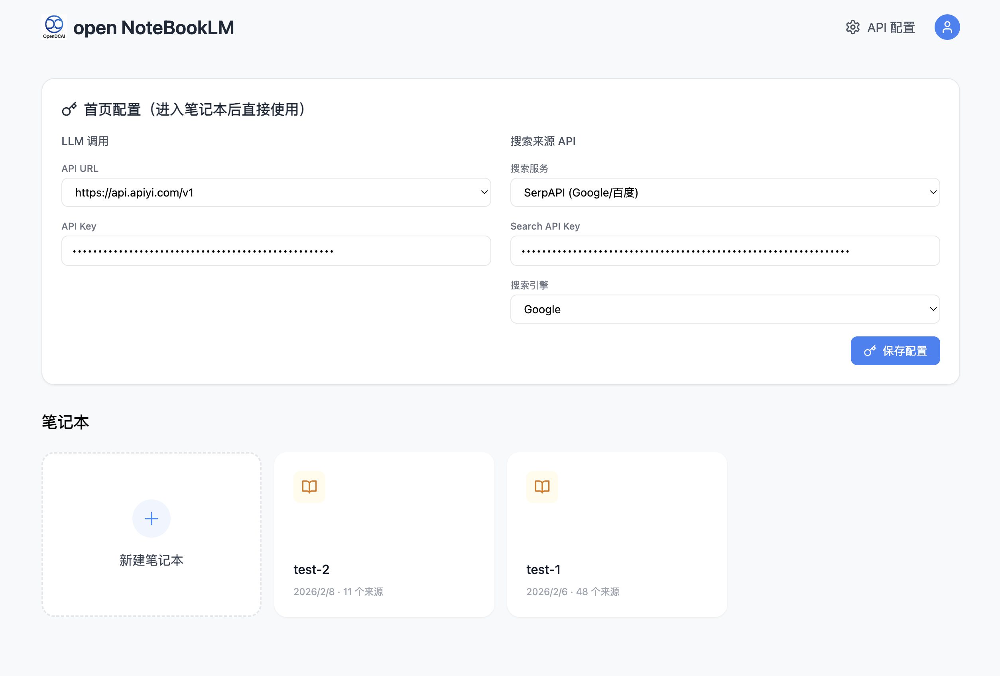
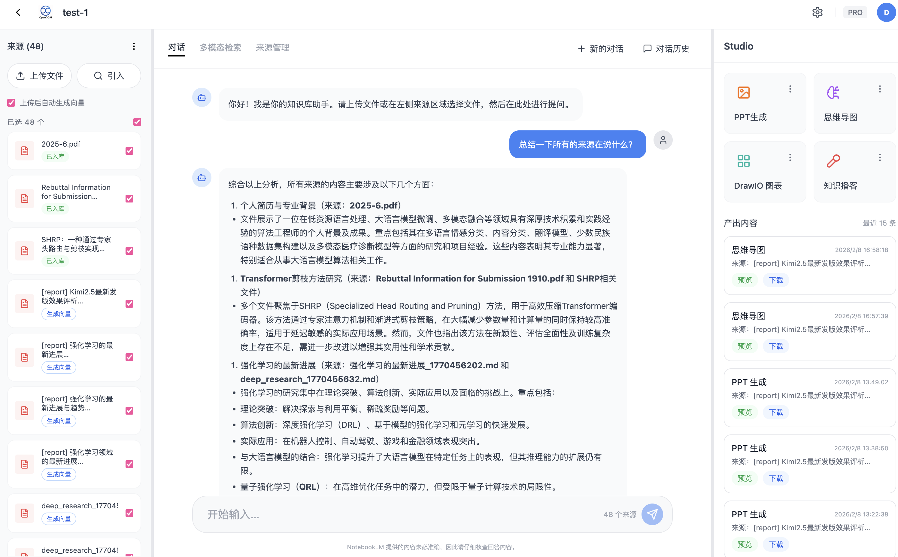
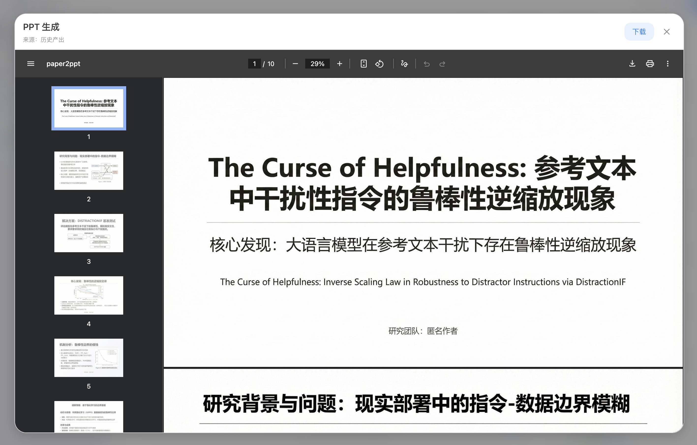
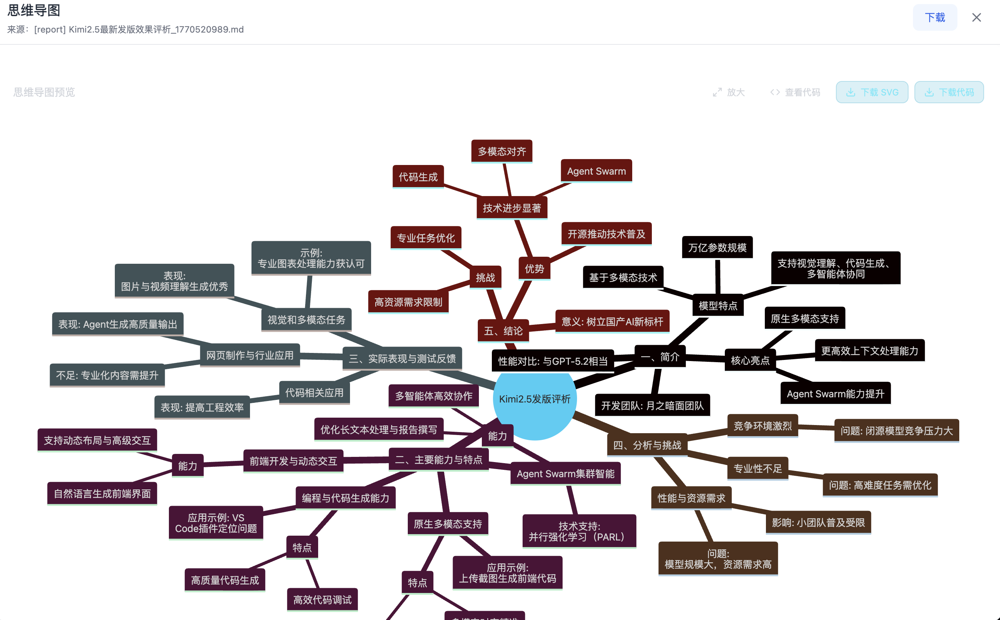
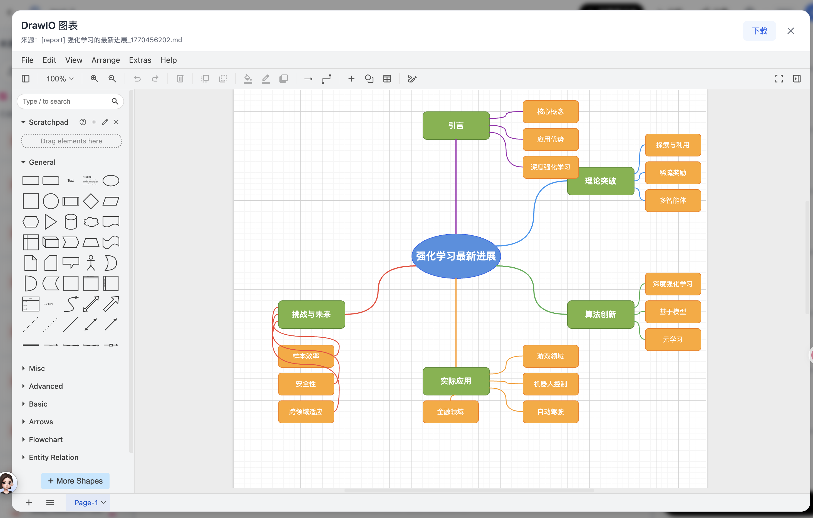

<div align="center">


# OpenNotebookLM

[](https://www.python.org/)
[](LICENSE)

[中文](README.md) | English

✨ **A NotebookLM-style knowledge-base workflow: upload documents, chat with sources, and generate PPTs, mind maps, podcasts, and DrawIO diagrams in one click** ✨

| 📚 **Knowledge Base** &nbsp;|&nbsp; 💬 **Smart QA** &nbsp;|&nbsp; 🎨 **Multimodal Generation** &nbsp;|&nbsp; 🔍 **Semantic Search** |

<br>

<a href="#-quick-start" target="_self">
  
</a>
<a href="docs/" target="_blank">
  
</a>
<a href="docs/contributing.md" target="_blank">
  
</a>

<br>
</div>

---

## 📑 Table of Contents

- [✨ Core Features](#-core-features)
- [📸 Showcase](#-showcase)
- [🚀 Quick Start](#-quick-start)
- [📂 Project Structure](#-project-structure)
- [🤝 Contributing](#-contributing)

---

## ✨ Core Features

> Built around **notebooks + knowledge base** on the DataFlow-Agent workflow engine: upload documents or papers, then use smart QA and one-click generation for multiple output types.

- **📚 Knowledge Base**: Upload files, browse and select sources (e.g. PDFs).
- **💬 Smart QA**: Ask questions grounded in selected documents; chat history is persisted locally.
- **🎨 PPT Generation**: Generate editable slide decks from your knowledge base or papers (Paper2PPT workflow).
- **🧠 Mind Maps**: Generate Mermaid mind maps from selected sources, with preview and export.
- **🎙️ Knowledge Podcast**: Turn knowledge-base content into podcast scripts and narration assets.
- **🎬 Video Narration**: Generate video scripts and narration content.
- **🧩 Paper2Drawio**: Generate editable DrawIO diagrams from papers, text, or images; inline edit and export.
- **🔍 Semantic Search**: Embedding-based semantic retrieval with configurable Top-K and models.

---

## 📸 Showcase

### Home

<div align="center">



</div>

### Notebook View (Sources & Chat)

<div align="center">



</div>

### PPT Generation

<div align="center">



</div>

### Mind Map

<div align="center">



</div>

### DrawIO Diagrams

<div align="center">



</div>

---

## 🚀 Quick Start

### Requirements


- **Python**: 3.10+
- **Node.js**: 18+ (for frontend build)
- **OS**: Linux (recommended) / Windows / macOS

### Backend

```bash
# 1. Clone
git clone <your-repo-url>
cd opennoteboolLM

# 2. Create and activate environment (Conda recommended)
conda create -n opennotebook python=3.11 -y
conda activate opennotebook

# 3. Install dependencies
pip install -r requirements-base.txt
pip install -e .

# 4. Environment variables (optional)
cp fastapi_app/.env.example fastapi_app/.env
# Edit fastapi_app/.env: DF_API_KEY, DF_API_URL, Supabase, etc.

# 5. Start backend
cd fastapi_app
uvicorn main:app --host 0.0.0.0 --port 8000
```

Health: <http://localhost:8000/health> · API docs: <http://localhost:8000/docs>

### Frontend

Both English and Chinese frontends are provided; use either.

**English (frontend_en, NotebookLM-style)**

```bash
cd frontend_en
npm install
cp .env.example .env   # Optional: VITE_API_KEY, VITE_DEFAULT_LLM_API_URL, Supabase, etc.
npm run dev
```

**Chinese (frontend_zh)**

```bash
cd frontend_zh
npm install
npm run dev
```

Open **http://localhost:3000** (or the port shown in the terminal, e.g. 3001).

### Environment Variables

- **Backend `fastapi_app/.env`**  
  - `DF_API_KEY`, `DF_API_URL`: LLM API.  
  - `SUPABASE_URL`, `SUPABASE_ANON_KEY`, etc.: optional, for auth and cloud storage.
- **Frontend `frontend_en/.env`**  
  - `VITE_API_KEY`: API key for backend requests (must match backend).  
  - `VITE_DEFAULT_LLM_API_URL`: default LLM provider URL.  
  - `VITE_SUPABASE_*`: optional, align with backend Supabase if used.

Without Supabase, the frontend can use a local mock user for development and try-out.

---

## 📂 Project Structure

```
opennoteboolLM/
├── dataflow_agent/          # Workflow engine
│   ├── agentroles/          # Agent definitions
│   ├── workflow/            # Workflows (Paper2PPT, PDF2PPT, Image2Drawio, KB, etc.)
│   ├── promptstemplates/    # Prompt templates
│   └── toolkits/            # Toolkits
├── fastapi_app/             # Backend API
│   ├── routers/             # KB, files, Paper2Drawio, Paper2PPT, etc.
│   └── workflow_adapters/   # Workflow adapters
├── frontend_en/             # English frontend (NotebookLM-style)
├── frontend_zh/             # Chinese frontend
├── database/                # DB scripts
├── docs/                    # Documentation
├── script/                  # CLI and scripts
├── static/                  # Assets and README images
└── outputs/                 # Generated outputs
```

---

## 🤝 Contributing

Issues, pull requests, and documentation improvements are welcome.

[](https://github.com/your-org/opennoteboolLM/issues)
[](https://github.com/your-org/opennoteboolLM/pulls)

See [Contributing](docs/contributing.md).

---

## 📄 License

This project is under [Apache License 2.0](LICENSE).

---

**Feature cards are based on: [OpenDCAI/Paper2Any](https://github.com/OpenDCAI/Paper2Any)**

---

<div align="center">

**If this project helps you, please give it a ⭐ Star**

</div>
